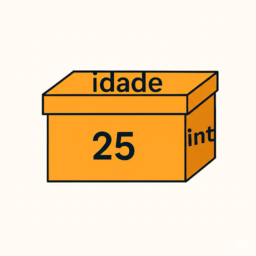

# Variáveis: Conceito

Uma variável é uma área reservada na memória do computador para armazenar temporariamente informações (dados). Como o próprio nome indica, o valor contido em uma variável pode ser modificado ao longo da execução do programa, conforme as instruções do algoritmo. Elas funcionam como recipientes dinâmicos que permitem a manipulação dos dados, tornando possível alterar seu conteúdo conforme a necessidade do processamento.

Para um computador, o ideal seria trabalhar diretamente com os endereços de memória onde os dados estão armazenados. No entanto, para tornar o processo mais intuitivo para os programadores, as linguagens de programação abstraem essa complexidade por meio das variáveis. Ao criar uma variável, atribuímos a ela um identificador, que funciona como um rótulo associado a uma área específica da memória. Sempre que precisarmos acessar ou modificar um valor armazenado, basta referenciá-lo por meio desse identificador.

As variáveis desempenham um papel fundamental nas linguagens de programação, pois permitem manipular dados sem a necessidade de lidar diretamente com seus endereços na memória. Essa abstração simplifica o desenvolvimento e torna o código mais legível e organizado.

Podemos imaginar uma variável como uma caixa identificada por um rótulo, na qual guardamos um determinado valor. O conteúdo dessa caixa não é fixo; ele pode ser alterado ao longo da execução do programa. No entanto, cada variável segue um tipo específico de dado. Por exemplo, uma variável numérica pode armazenar qualquer valor inteiro ou decimal—positivo, negativo ou zero — mas sempre um único valor por vez.

